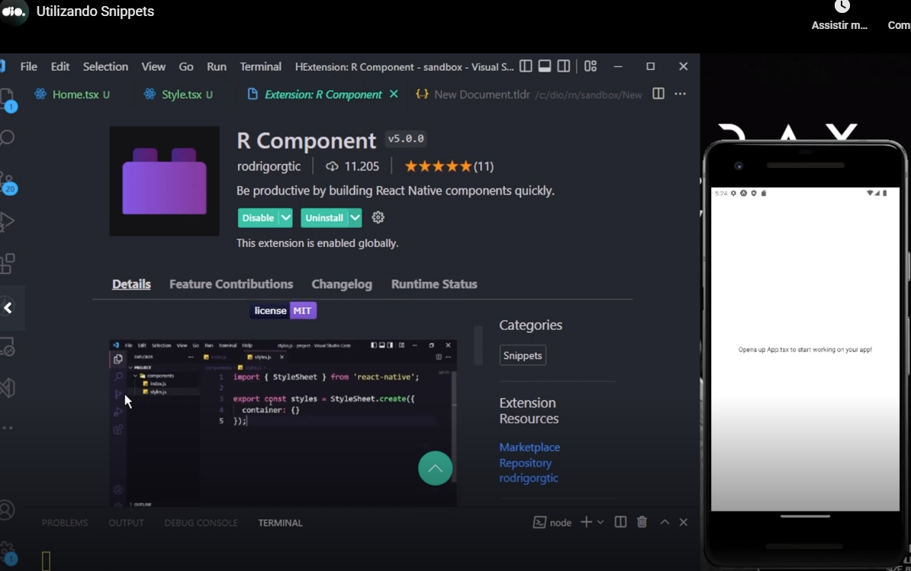

# Gerneral


### Creating the project

Please type this command in the terminal:

```
npx create-expo-app bat-pass-app -t
```

I requested by terminal to confirm the installation of 'create-expo-app'. After the installation, when requested to select a template, I selected "Blank (TypeScript)".

Then I entered in the created directory (`cd bat-pass-app`).


### Installing the dependencies

Before run the project, I installed the project dependencies with the following command:

```
npm install
```


### Running the project

```
npm run start
```


### Seeing the project in the app

To see the project in the App, in the Expo App already installed in the cellphone, I scanned the QR code showed by the command `npm run start`.


### Testing the created project

To test, I changed a text in App.tsx in the created project.


### Directory structure

Teacher instructed us to create in the root folder the directory **src** and inside this directory we can put directories, as example "components" and "screens".


### All in React Native is a component

Teacher enforced this concept **"all in React Native is a component"**. As example, a screen is also a component and can return another component.


### Vysor App

If viewing the app in PC is be necessary, you could install Vysor app.

OBS:

- you will need to enable developer options in the cellphone;
- in the developer options, you will need to enable USB Debugging in the cellphone;
- On connecting the cellphone in the PC, when requested please authorize the connectiom om the cellphone;
- You will can see the device listed in the result of the command `adb devices`.


### First screen debug

Teacher instructed us to create the file **src/screens/Home.tsx** with this code:

```
import React from "react";
import {Text} from "react-native";

export default function Home() {
    return (
        <Text>Home works!!</Text>
    );
}
```

We used this screen importing it an inserting a tag &lt;Home&gt;in **App.tsx**. The resulted code of App.tsx was:

```
import { StatusBar } from 'expo-status-bar';
import { StyleSheet, Text, View } from 'react-native';
import Home from "./src/screens/Home";

export default function App() {
  return (
    <View style={styles.container}>
      <Home />
      <Text>Coringão</Text>
      <StatusBar style="auto" />
    </View>
  );
}

const styles = StyleSheet.create({
  container: {
    flex: 1,
    backgroundColor: '#fff',
    alignItems: 'center',
    justifyContent: 'center',
  },
});
```

Note that as you can see in the above code, I made a little change of the default text in App.tsx.

The result viewing through Vysor app was:


## Putting major code in Home.tsx

I will not put the entire code here, but teacher passed major of the code to Home.tsx and moved some imports also.

The resulted exported function in App.tsx passed to be:

```
export default function App() {
    return (
        <Home />
    )
}
```

In the process, while do not inserting the stylesheet also in Home.tsx, the external component of Home.tsx was a fragment.

```
export default function Home() {
    return (
        <>
          ...
        </> 
    )
}
```

**But in the final initial code**, the source code of Home.tsx looked like:

```
...
export default function Home() {
  return (
    <View style={styles.container}>
      ...
    </View>
  );
}

const styles = StyleSheet.create({
  container: {
    flex: 1,
    backgroundColor: '#fff',
    alignItems: 'center',
    justifyContent: 'center',
  },
});
```


## Passing the stylesheet to an external file

Teacher passed the stylesheet to an external file, removing it from the screen (in imy project it was in App.tsx, but is the same idea).

Then please remove this code from the screen file or App.tsx and pass it to the file 'src/screens/Style.tsx':

```
import { StyleSheet } from 'react-native';

export default StyleSheet.create({
  container: {
    flex: 1,
    backgroundColor: '#fff',
    alignItems: 'center',
    justifyContent: 'center',
  },
});
```


# Snippets

Teacher asked us to install this extension in VSCode to create a snippet:



Then teacher asked us to create the component **src/components/Menu** (directory) with the files:

- Menu.tsx;
- MenuStyles.tsx.

To create the contents, teacher asked us:

- to type the command `rbnc` of the new **VSCode** plugin in the file Menu.tsx;
- In the stylesheet file (MenuStyles.tsx), the command do type was `rnso`.

In **Menu.tsx** we only had to adjust the path of the stylesheet file to point to MenuStyles.tsx. The content of this file passed to be:

```
import React from 'react';
import { View } from 'react-native';

import { styles } from './MenuStyles';

export function Menu() {
  return (
    <View style={styles.container}>

    </View>
  );
}
```

The content of MenuStyles.tsx was the content provided by the plugin:

```
import { StyleSheet } from 'react-native';

export const styles = StyleSheet.create({
  container: {}
});
```

Then teacher used the new created &lt;Menu /&gt; component in Home.tsx. After inserting a &lt;View /&gt; component to be the external component and inserting the &lt;Menu /&gt; component as the children component, the code of Home.tsx passed to be similar to:

```
import React from "react";
import {View, Text} from "react-native";
import { Menu } from "../components/Menu/Menu";


export default function Home() {
    return (
          <View>
            <Menu></Menu>
            <Text>Home works!!</Text>
          </View>
    );
}
```


# Changing things in the "containers"

Teacher did some general changes (stylesheet, moved places of things etc). Nothing new. No new concept in the class "Trabalhando os Containers". I ask you to see the project in the "tests/main" directory.


# Creating the text input component

In this new created component nothing new. We created a main file (tests/main/bat-pass-app/src/components/BatTextInput/BatTextInput.tsx) and a file to receive it stylezation file (tests/main/bat-pass-app/src/components/BatTextInput/BatTextInputStyles.tsx).

The contents where created with the commands rnbc (React Native basic component in tests/main/bat-pass-app/src/components/BatTextInput/BatTextInput.tsx) amd rnso (React Native Stylesheet Object un tests/main/bat-pass-app/src/components/BatTextInput/BatTextInputStyles.tsx).

And after teacher adjusted paths and the style properties.


# Container of BatTextInput

The next class was simple. No new concept. Teacher created a new node (simminar do CSS class) in src/screens/Style.tsx, in src/screens/Home.tsx inserted a &lt;View&gt; arround the &lt;BatTextInput&gt;, acting as a container and aplied the created new "CSS class" to this view and persolized the style configurations in src/screens/Style.tsx.


# Bat Button

Next teacher created a component &lt;BatButton&gt; and inserted it.


# Current class: Criando um Pressable


# Repository related to the classes

[link](https://github.com/felipeAguiarCode/react-native-bat-pass-generator)