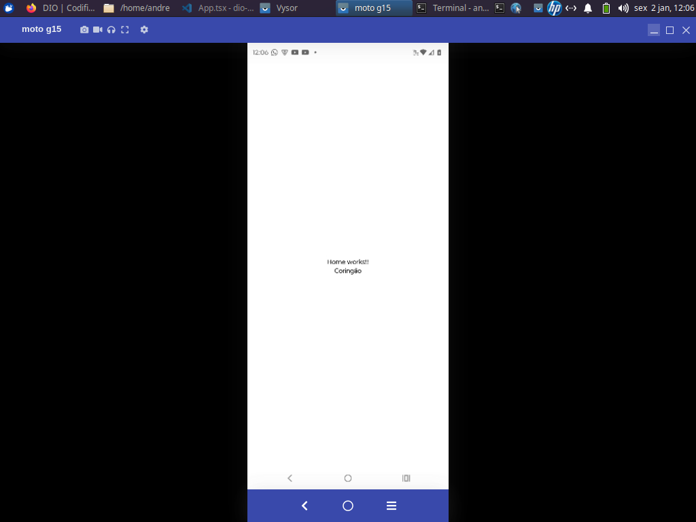

# Gerneral


### Creating the project

Please type this command in the terminal:

```
npx create-expo-app bat-pass-app -t
```

I requested by terminal to confirm the installation of 'create-expo-app'. After the installation, when requested to select a template, I selected "Blank (TypeScript)".

Then I entered in the created directory (`cd bat-pass-app`).


### Installing the dependencies

Before run the project, I installed the project dependencies with the following command:

```
npm install
```


### Running the project

```
npm run start
```


### Seeing the project in the app

To see the project in the App, in the Expo App already installed in the cellphone, I scanned the QR code showed by the command `npm run start`.


### Testing the created project

To test, I changed a text in App.tsx in the created project.


### Directory structure

Teacher instructed us to create in the root folder the directory **src** and inside this directory we can put directories, as example "components" and "screens".


### All in React Native is a component

Teacher enforced this concept **"all in React Native is a component"**. As example, a screen is also a component and can return another component.


### Vysor App

If viewing the app in PC is be necessary, you could install Vysor app.

OBS:

- you will need to enable developer options in the cellphone;
- in the developer options, you will need to enable USB Debugging in the cellphone;
- On connecting the cellphone in the PC, when requested please authorize the connectiom om the cellphone;
- You will can see the device listed in the result of the command `adb devices`.


### First screen debug

Teacher instructed us to create the file **src/screens/Home.tsx** with this code:

```
import React from "react";
import {Text} from "react-native";

export default function Home() {
    return (
        <Text>Home works!!</Text>
    );
}
```

We used this screen importing it an inserting a tag &lt;Home&gt;in **App.tsx**. The resulted code of App.tsx was:

```
import { StatusBar } from 'expo-status-bar';
import { StyleSheet, Text, View } from 'react-native';
import Home from "./src/screens/Home";

export default function App() {
  return (
    <View style={styles.container}>
      <Home />
      <Text>Coringão</Text>
      <StatusBar style="auto" />
    </View>
  );
}

const styles = StyleSheet.create({
  container: {
    flex: 1,
    backgroundColor: '#fff',
    alignItems: 'center',
    justifyContent: 'center',
  },
});
```

Note that as you can see in the above code, I made a little change of the default text in App.tsx.

The result viewing through Vysor app was:




## Putting major code in Home.tsx

I will not put the entire code here, but teacher passed major of the code to Home.tsx and moved some imports also.

The resulted exported function in App.tsx passed to be:

```
export default function App() {
    return (
        <Home />
    )
}
```

In the process, while do not inserting the stylesheet also in Home.tsx, the external component of Home.tsx was a fragment.

```
export default function Home() {
    return (
        <>
          ...
        </> 
    )
}
```

**But in the final initial code**, the source code of Home.tsx looked like:

```
...
export default function Home() {
  return (
    <View style={styles.container}>
      ...
    </View>
  );
}

const styles = StyleSheet.create({
  container: {
    flex: 1,
    backgroundColor: '#fff',
    alignItems: 'center',
    justifyContent: 'center',
  },
});
```